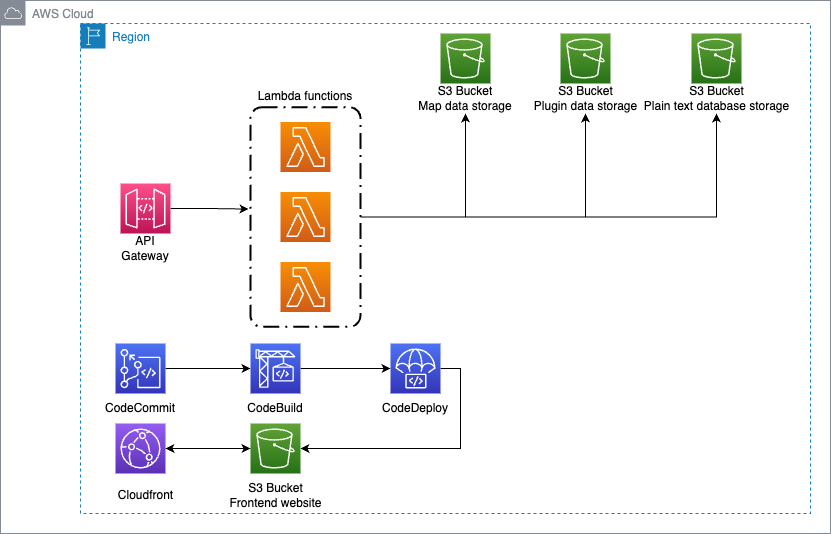

# mineralcontest-serverless-infrastructure

This is the repo of the Mineral contest infrastructure - serverless edition.
This project runs on AWS and lever the use of:
* AWS Lambda
* AWS API Gateway
* AWS Cognito
* AWS CodeCommit
* AWS CodeBuild
* AWS CodeDeploy
* AWS S3

The goal is to get rid of the current infrastructure which is:
- Server rent each month running 24/24
- Database server running 24/24
- Website powered by Symfony 4
- File stored on a server running 24/24 without backups.

# Why the migration?
I have started this project during my degree in Computer Science and had knowledge in web development that I wanted to use. It started first with the development of a Minecraft plugin written in Java using CraftBukkit API, followed by a website that would allow users to upload custom created maps, and download other available maps.

I want to make that migration to a serverless architecture because, in a first place, I want to save money, let's be honest :).
I am also trying to be more 'green' by only using resources when needed.
Finally, I want something scalable and highly-available when needed.

# What will the infrastructure look like?

# What technologies will you use?

To provision and create the infrastructure, I will be using Terraform.
To create the front-end website, I will be using a JavaScript framework, [XXX]
To handle the API request, I will be using Python 3.9
